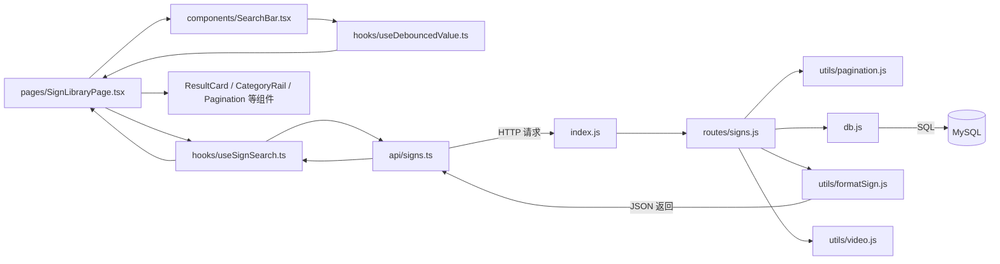

# 学习笔记：一张搜索请求在 src 文件间的完整旅程（Search & Browse）

> 用途：以**真实 `src` 代码**为主线，按执行顺序走完"搜索 + 浏览"这条业务链。
> 这份文档 = 把每个 src 文件的实际代码放进请求的执行顺序里看，数据怎么在文件间流动。
> 配套阅读：`reading-guide-search-browse.md`（概念讲解）、`business-chain-search-browse.md`（链条串讲）

---

## 执行总览（看顺序）



---

## 🟢 前端（client/src）—— 请求发起

### 第 1 站：`pages/SignLibraryPage.tsx`（总装车间，页面入口）

用户打开首页，这个组件挂载。它持有状态、调用 hooks、决定渲染什么。

```tsx
const [searchParams, setSearchParams] = useSearchParams();
const page = Number(searchParams.get("page")) || 1;      // 从 URL 读页码
const tag = searchParams.get("tag") ?? "";               // 从 URL 读分类
const [queryInput, setQueryInput] = useState(searchParams.get("query") ?? "");
const debouncedQuery = useDebouncedValue(queryInput, 300);  // 防抖
```

**数据流向**：URL（`?query=&tag=&page=`）→ 本地 state → 防抖 → 后续全链路。

### 第 2 站：`components/SearchBar.tsx`（用户打字）

```tsx
<input
  type="search"
  value={value}                          // ← 受控组件，值来自父组件
  onChange={(e) => onChange(e.target.value)}  // → 每敲一个字母就回调父组件
/>
```

**数据流向**：`e.target.value`（用户输入）→ `onChange` → 父组件 `setQueryInput`。搜索框本身不存状态，是**受控组件**（受父组件控制）。

### 第 3 站：`hooks/useDebouncedValue.ts`（防抖 300ms）

```ts
export function useDebouncedValue<T>(value: T, delayMs: number): T {
  const [debounced, setDebounced] = useState(value);
  useEffect(() => {
    const timer = window.setTimeout(() => setDebounced(value), delayMs);
    return () => window.clearTimeout(timer);   // 清理函数 = 防抖关键
  }, [value, delayMs]);
  return debounced;
}
```

**数据流向**：`queryInput`（每键变）→ 定时器 → 停手 300ms 后 → `debouncedQuery`（稳定值）。

### 第 4 站：回到 `pages/SignLibraryPage.tsx`（同步 URL）

```tsx
useEffect(() => {
  const currentQuery = searchParams.get("query") ?? "";
  if (debouncedQuery === currentQuery) return;      // 相同就跳过，避免死循环
  setSearchParams((prev) => {
    const params = new URLSearchParams(prev);
    if (debouncedQuery) params.set("query", debouncedQuery);
    else params.delete("query");
    params.delete("page");                          // 重新搜索 → 回第 1 页
    return params;
  });
}, [debouncedQuery]);
```

**数据流向**：`debouncedQuery` → 写入 URL `?query=hello`（删掉 page）。只有**防抖后的稳定值**才进 URL，避免打字时 URL 导航竞态丢字符。

### 第 5 站：`hooks/useSignSearch.ts`（触发请求 + 管理三态）

```ts
export function useSignSearch({ query, tag, page }: Params) {
  const [data, setData] = useState<SignsResponse | null>(null);
  const [isLoading, setIsLoading] = useState(true);
  const [isError, setIsError] = useState(false);

  useEffect(() => {
    const controller = new AbortController();          // 取消令牌
    setIsLoading(true);
    setIsError(false);
    fetchSigns({ query, tag, page, signal: controller.signal })
      .then(setData)                                    // 成功 → 存数据
      .catch((err) => {
        if (err.name !== "AbortError") { console.error(err); setIsError(true); }
      })
      .finally(() => { if (!controller.signal.aborted) setIsLoading(false); });
    return () => controller.abort();                    // 清理：取消旧请求防竞态
  }, [query, tag, page]);                               // 这三个变 → 重新请求

  return { data, isLoading, isError };
}
```

**数据流向**：`{query, tag, page}` → 调 `fetchSigns` → 成功后 `setData` 更新界面三态。

### 第 6 站：`api/signs.ts`（发出 HTTP 请求）

```ts
export async function fetchSigns({ query, tag, page, pageSize, signal }: FetchSignsParams): Promise<SignsResponse> {
  const params = new URLSearchParams();
  if (query) params.set("query", query);
  if (tag) params.set("tag", tag);
  if (page) params.set("page", String(page));
  if (pageSize) params.set("pageSize", String(pageSize));

  const res = await fetch(`${API_BASE}/signs?${params.toString()}`, { signal });
  if (!res.ok) throw new Error(`Failed to fetch signs (${res.status})`);  // fetch 不会自动抛错！
  return res.json();
}
```

**发出的请求**：`GET /api/signs?query=hello&tag=greeting&page=1`

---

## 🟡 后端（server/src）—— 请求处理

### 第 7 站：`index.js`（服务器入口，按 URL 分发）

```js
app.use("/api/signs", signsRouter);      // /api/signs 开头 → 交给 signs.js
```

### 第 8 站：`routes/signs.js` —— `GET /`（核心 handler）

```js
router.get("/", async (req, res, next) => {
  try {
    const { query = "", tag = "" } = req.query;
    const { page, pageSize, offset } = parsePagination(req.query);   // 工具1
    const trimmedQuery = query.trim();
    const trimmedTag = tag.trim();

    // --- 拼 WHERE：搜索（模糊）+ 筛选（精确）---
    const conditions = [];
    const params = [];
    if (trimmedQuery) {
      const like = `%${trimmedQuery}%`;
      conditions.push(
        "(gloss LIKE ? OR JSON_SEARCH(keywords, 'one', ?) IS NOT NULL OR JSON_SEARCH(tags, 'one', ?) IS NOT NULL OR JSON_SEARCH(definitions, 'one', ?) IS NOT NULL)"
      );
      params.push(like, like, like, like);
    }
    if (trimmedTag) {
      conditions.push("JSON_CONTAINS(tags, JSON_QUOTE(?))");
      params.push(trimmedTag);
    }
    const whereClause = conditions.length ? `WHERE ${conditions.join(" AND ")}` : "";

    // --- 先 COUNT 总数 ---
    const [countRows] = await pool.query(`SELECT COUNT(*) AS total FROM signs ${whereClause}`, params);
    const totalResults = countRows[0].total;

    // --- 相关度排序（关键词命中优先）---
    let orderClause = "ORDER BY gloss ASC";
    let orderParams = [];
    if (trimmedQuery) {
      const like = `%${trimmedQuery}%`;
      orderClause = `ORDER BY
        CASE
          WHEN gloss LIKE ? THEN 0
          WHEN JSON_SEARCH(keywords, 'one', ?) IS NOT NULL THEN 1
          WHEN JSON_SEARCH(tags, 'one', ?) IS NOT NULL THEN 2
          ELSE 3
        END ASC, gloss ASC`;
      orderParams = [like, like, like];
    }

    // --- 取这一页 ---
    const [rows] = await pool.query(
      `SELECT * FROM signs ${whereClause} ${orderClause} LIMIT ? OFFSET ?`,
      [...params, ...orderParams, pageSize, offset]
    );

    // --- 批量查预览视频（防 N+1）---
    const signIds = rows.map((row) => row.id);
    const previewBySignId = new Map();
    if (signIds.length) {
      const [videoRows] = await pool.query(
        `SELECT sign_id, source_id, file_name, video_url FROM sign_videos WHERE sign_id IN (?) ORDER BY sign_id ASC, source_id ASC`,
        [signIds]
      );
      for (const video of videoRows) {
        if (!previewBySignId.has(video.sign_id)) {
          previewBySignId.set(video.sign_id, formatVideo(video));   // 工具3
        }
      }
    }

    // --- 组装返回 ---
    res.json({
      results: rows.map((row) => ({ ...formatSign(row), previewVideo: previewBySignId.get(row.id) ?? null })),
      pagination: buildPaginationMeta(page, pageSize, totalResults),  // 工具1
      query: { query: trimmedQuery || null, tag: trimmedTag || null },
    });
  } catch (err) { next(err); }
});
```

### 第 9 站：`utils/pagination.js`（分页工具，被上面调用）

```js
const DEFAULT_PAGE_SIZE = 6;
const MAX_PAGE_SIZE = 50;

function parsePagination(query) {
  const page = Math.max(1, parseInt(query.page, 10) || 1);
  const pageSize = Math.min(MAX_PAGE_SIZE, Math.max(1, parseInt(query.pageSize, 10) || DEFAULT_PAGE_SIZE));
  const offset = (page - 1) * pageSize;
  return { page, pageSize, offset };
}

function buildPaginationMeta(page, pageSize, totalResults) {
  return { page, pageSize, totalResults, totalPages: Math.max(1, Math.ceil(totalResults / pageSize)) };
}
```

### 第 10 站：`db.js`（真正连数据库）

```js
const pool = mysql.createPool({
  host: process.env.DB_HOST || "localhost",
  port: Number(process.env.DB_PORT) || 3306,
  user: process.env.DB_USER || "root",
  password: process.env.DB_PASSWORD || "",
  database: process.env.DB_NAME || "auslan_learning",
  waitForConnections: true,
  connectionLimit: 10,
});
module.exports = pool;
```

所有 `pool.query(...)` 都从这个连接池拿连接执行 SQL。

### 第 11 站：`utils/formatSign.js`（下划线 → 驼峰）

```js
function formatSign(row) {
  return {
    id: row.id,
    gloss: row.gloss,
    definitions: row.definitions,
    usageNotes: row.usage_notes,   // 翻译点
    source: row.source,
    tags: row.tags ?? [],          // NULL 兜底
    keywords: row.keywords ?? [],
  };
}
```

### 第 12 站：`utils/video.js`（视频行 → 驼峰 + 拼 URL）

```js
const VIDEO_BASE_URL = (process.env.VIDEO_BASE_URL || "").replace(/\/+$/, "");

function formatVideo(row) {
  return {
    sourceId: row.source_id,
    fileName: row.file_name,
    videoUrl: row.video_url || (VIDEO_BASE_URL ? `${VIDEO_BASE_URL}/${encodeURIComponent(row.file_name)}` : null),
  };
}
```

**返回给前端的 JSON**（对应 `types.ts` 的 `SignsResponse`）：
```json
{
  "results": [
    { "id": 5, "gloss": "HELLO", "definitions": [...], "usageNotes": [...],
      "source": "...", "tags": ["greeting"], "keywords": ["hi","hey"],
      "previewVideo": { "sourceId": "A001", "fileName": "hello.mp4", "videoUrl": null } }
  ],
  "pagination": { "page": 1, "pageSize": 6, "totalResults": 35, "totalPages": 6 },
  "query": { "query": "hello", "tag": "greeting" }
}
```

---

## 🟢 前端（client/src）—— 结果渲染

### 第 13 站：回到 `api/signs.ts` → `hooks/useSignSearch.ts` → `pages/SignLibraryPage.tsx`

```ts
const results = data?.results ?? [];                          // 结果列表
const totalPages = data?.pagination.totalPages ?? 1;          // 总页数
const totalResults = data?.pagination.totalResults ?? 0;      // 总条数
```

### 第 14 站：`pages/SignLibraryPage.tsx` 的渲染分支

```tsx
{isLoading ? (
  <ul className="result-list">
    {Array.from({ length: 6 }).map((_, i) => <ResultCardSkeleton key={i} />)}  // 骨架屏
  </ul>
) : results.length === 0 && !isError ? (
  <EmptyState onClear={clearFilters} />                        // 空状态
) : (
  <ul className="result-list">
    {results.map((sign) => <ResultCard key={sign.id} sign={sign} />)}  // 结果卡片
  </ul>
)}
```

### 第 15 站：`components/ResultCard.tsx`（每张卡片）

```tsx
export function ResultCard({ sign }: Props) {
  const preview = primarySense(sign);                          // definitions[0].senses[0]
  const previewVideoUrl = sign.previewVideo?.videoUrl;
  ...
  {previewVideoUrl ? (
    <video src={previewVideoUrl} autoPlay muted loop ... />     // 有视频 → 播放预览
  ) : (
    <PlaceholderMedia seed={sign.id} gloss={sign.gloss} />      // 没视频 → 占位图
  )}
  {isLearned(sign.id) && <span className="learned-badge">✓ Learned</span>}  // 已学徽章
  ...
  {sign.tags.map((tag) => <Link to={`/?tag=${...}`} style={tagChipStyle(tag)}>#{tag}</Link>)}
}
```

**用到的其他 src 文件**：
- `lib/tagColors.ts` → `tagChipStyle(tag)`：把 tag 字符串哈希成固定色相，同 tag 颜色一致
- `lib/learnedSigns.ts` → `isLearned(id)`：读 localStorage 判断是否已学（属于另一条线，这里只用判断）
- `components/PlaceholderMedia.tsx` → 用 `sign.id` 算固定色相渐变块 + "Placeholder" 字样，不冒充真实素材

### 第 16 站：`components/CategoryRail.tsx`（左侧分类栏）

```tsx
export function CategoryRail({ tags, activeTag }: Props) {
  if (tags.length === 0) return null;
  ...
  {tags.map(({ tag, count }) => (
    <Link to={`/?tag=${encodeURIComponent(tag)}`} className={activeTag === tag ? "active" : ""}>
      <span>{tag}</span><span className="category-rail-count">{count}</span>
    </Link>
  ))}
}
```

分类数据来自 `hooks/useTags.ts` → `api/signs.ts` 的 `fetchTags` → `GET /api/signs/tags`（后端在 `routes/signs.js` 的 `/tags` handler 用 `Map` 计数返回）。

### 第 17 站：`components/Pagination/HandGlyphPagination.tsx`（分页）

```tsx
export function HandGlyphPagination({ page, totalPages, onPageChange }: Props) {
  if (totalPages <= 1) return null;                    // 只有一页不显示
  ...
  {getVisiblePages(page, totalPages).map((entry, i) => /* 页码 + 省略号 */)}
}
```

点页码 → `onPageChange(p)` → `SignLibraryPage` 的 `updateParams({page: p})` → 更新 URL → `scrollTo(top:0)` → `useSignSearch` 重新发请求 → 回到第 5 站循环。

---

## 一条完整的真实数据流（背这个）

```
用户输入 "hello" + 点 "greeting" + 在第 1 页
  │
  ▼ client/src/pages/SignLibraryPage.tsx
queryInput="hello" ──防抖300ms──▶ debouncedQuery="hello"
  │  useEffect 把 URL 改成 ?query=hello&tag=greeting
  ▼ client/src/hooks/useSignSearch.ts
fetchSigns({query:"hello", tag:"greeting", page:1})
  ▼ client/src/api/signs.ts
GET /api/signs?query=hello&tag=greeting&page=1
  ▼ server/src/index.js ──▶ routes/signs.js
  ▼ utils/pagination.js ──▶ db.js（pool.query）
SQL: SELECT ... WHERE (gloss LIKE '%hello%' OR JSON_SEARCH(...)) AND JSON_CONTAINS(tags,'"greeting"')
     ORDER BY CASE WHEN ... END ASC, gloss ASC LIMIT 6 OFFSET 0
  ▼ 批量 IN 查视频 ──▶ formatSign + formatVideo ──▶ res.json(SignsResponse)
  ▼ 回到 client：api/signs.ts → useSignSearch(setData)
  ▼ pages/SignLibraryPage.tsx 渲染
ResultCard × 6 + CategoryRail + HandGlyphPagination
```

---

## 每个 src 文件一句话角色卡

| 文件（client/src） | 角色 |
|---|---|
| `pages/SignLibraryPage.tsx` | 总装车间：状态 + URL 同步 + 渲染分支 |
| `components/SearchBar.tsx` | 受控输入框，收集用户输入 |
| `hooks/useDebouncedValue.ts` | 防抖 300ms |
| `hooks/useSignSearch.ts` | 请求 + 三态 + AbortController 防竞态 |
| `hooks/useTags.ts` | 挂载时拉一次分类 |
| `api/signs.ts` | fetch 封装 + `!res.ok` 判错 |
| `api/types.ts` | 数据契约（前后端形状对齐） |
| `components/CategoryRail.tsx` | 左侧分类导航 |
| `components/ResultCard.tsx` | 每张结果卡片 |
| `components/ResultCardSkeleton.tsx` | 加载骨架屏 |
| `components/EmptyState.tsx` | 空结果提示 + 清除筛选 |
| `components/PlaceholderMedia.tsx` | 无视频时的占位图 |
| `components/Pagination/HandGlyphPagination.tsx` | 页码导航 |
| `lib/tagColors.ts` | tag → 固定色相 |
| `lib/learnedSigns.ts` | localStorage 判断"已学"（另一条线） |

| 文件（server/src） | 角色 |
|---|---|
| `index.js` | 服务器入口，路由分发 |
| `routes/signs.js` | 核心：搜索/筛选/排序/分页/批量视频 |
| `utils/pagination.js` | 页码解析 + 分页元信息 |
| `utils/formatSign.js` | 下划线 → 驼峰 |
| `utils/video.js` | 视频行 → 驼峰 + 拼 URL |
| `db.js` | 数据库连接池 |
